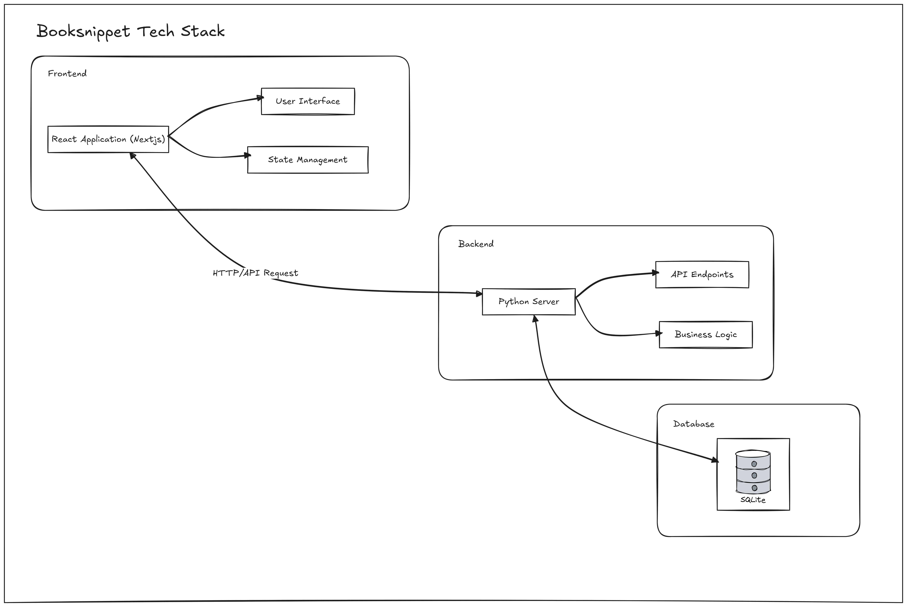

# BookSnippet - Backend API Structure

API Backend With FastAPI to manage create books, user with privliged admin auth

# 1. How Our App Strucure

## Endpoints

### Users

Description: This endpoint is used for [insert purpose here].

Method: GET

URL: `/users`

Parameters:

- `userID`: [userID : INT]

Response:

- Success: [User Created!]
- Error: [Internal Server Error]

### Books

Description: This endpoint is used for [insert purpose here].

Method: POST

URL: `/books`

Parameters:

- `param1`: [description of param1]
- `param2`: [description of param2]

Request Body:

- [description of request body]

Response:

- Success: [description of success response]
- Error: [description of error response]

### Endpoint 3

Description: This endpoint is used for [insert purpose here].

Method: PUT

URL: `/endpoint3`

Parameters:

- `param1`: [description of param1]
- `param2`: [description of param2]

Request Body:

- [description of request body]

Response:

- Success: [description of success response]
- Error: [description of error response]

### Endpoint 4

Description: This endpoint is used for [insert purpose here].

Method: DELETE

URL: `/endpoint4`

Parameters:

- `param1`: [description of param1]
- `param2`: [description of param2]

Response:

- Success: [description of success response]
- Error: [description of error response]
